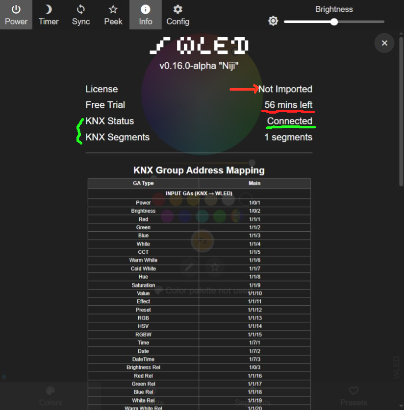
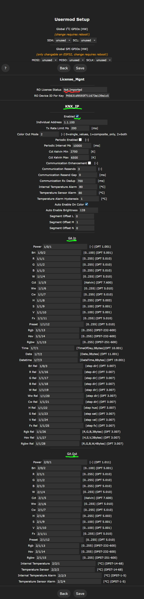
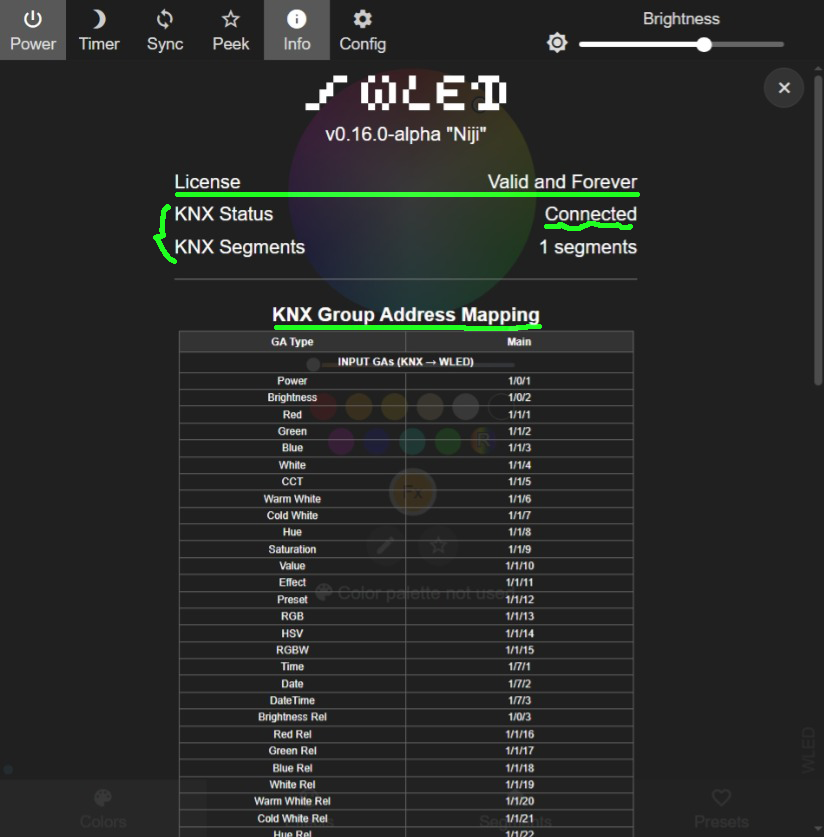
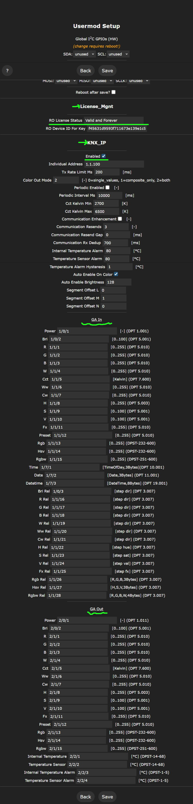

# KNX IP Usermod

This usermod enables KNX/EIB integration for WLED, allowing control of LED strips and segments via KNX bus communication.

Copy all the content in the section `RO Device ID For Key` in License_Mgnt and send it to the vendor for key generation and service authorization. Without the device key, it will have a 60-minute FREE trial. 

Go to your device host ip + `/edit` (e.g. http://192.168.71.24/edit) in browser and import the key file naming `DEVICE_KEY`. After importing the Device key:

## Installation

Copy the example `platformio_override_KNX_IP.ini` to the root directory and rename it to `platformio_override.ini`.  This file should be placed in the same directory as `platformio.ini`.

## Features

- **Central Control**: Control main strip power, brightness, color, and effects via KNX
- **Per-Segment Control**: Individual KNX control for each WLED segment with configurable Group Address offsets
- **GA Conflict Detection**: Automatic validation to prevent duplicate Group Addresses
- **Bidirectional Communication**: Send and receive KNX telegrams
- **Multiple Data Types**: Support for boolean, 1-byte, 2-byte, and 3-byte KNX data types

## Testing

Comprehensive test suites are available in the `/test/` directory:
- **Unit Tests**: Core functionality validation
- **Integration Tests**: End-to-end testing with real KNX stack
- **GA Conflict Tests**: Address conflict detection validation

See `/test/README_TESTING.md` and `/test/GA_CONFLICT_TESTS.md` for detailed testing information.

## Debug Logging

See `README_KNX_DEBUG.md` for information on enabling detailed debug output for troubleshooting.

## Todo
- If running in the WiFi Access Point mode (without any network WiFi/Ethernet connection), it will not run the real KNX_IP service.
- Added the enabled checkout to configure the status (i.e. group output objects) updated to the KNX bus.