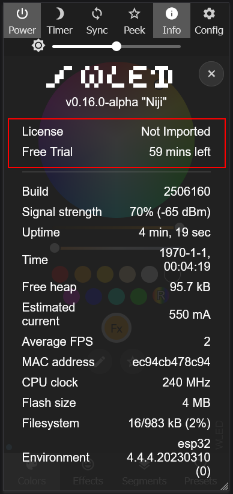
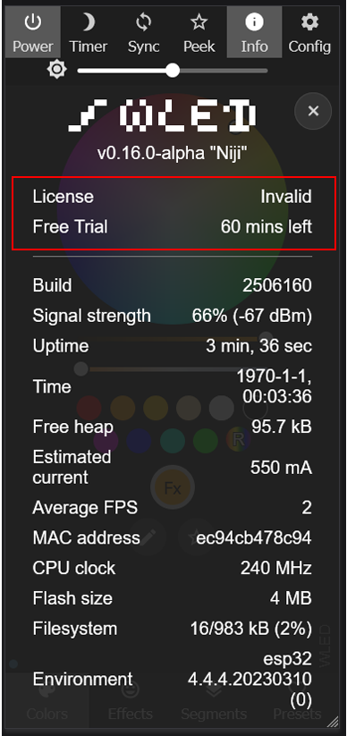
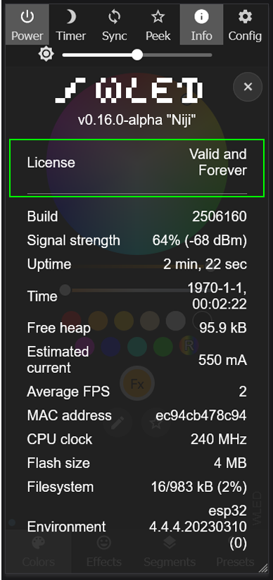
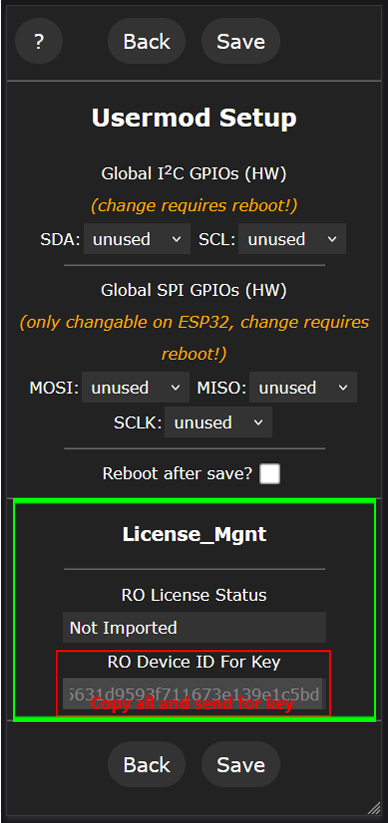
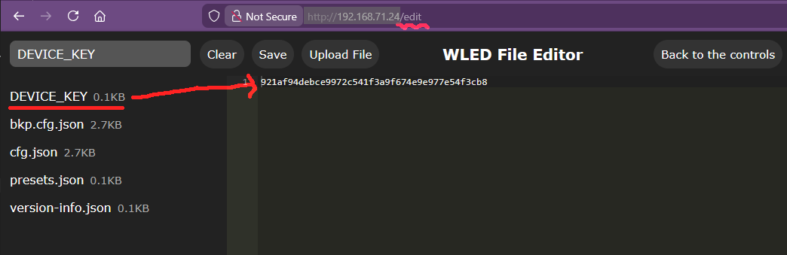

# License_Mgnt Usermod

# Note

This License Management  user mode offers multiple protections for some other customized user modes and governs the usage or redistribution of software.

## Features
 - ✨ Display the License Management status (read-only) in the `Info` tab
 - ✨ Display the device ID (read-only) in usermod settings page
 - ✨ Import the device key in host + '/edit' link page (it will works after more than 1 minute)
 - ✨ If not right device key imported, it allows user have 60 mins free trial

## Compatibility
- ESP32 supports this user mode while ESP8266 does not support
- Check the device validated or not with 1 minute time window task

## Installation
- Add `License_Mgnt` to `custom_usermods` in your `platformio.ini` (or `platformio_override.ini`).

## 📝 Change Log

2026-01-18

- License_Mgnt usermod initial release with primary functions.
- License_Mgnt usermod created
* Documentation updated

## Authors
- M-Tech [@betamoojw](https://github.com/betamoojw)
