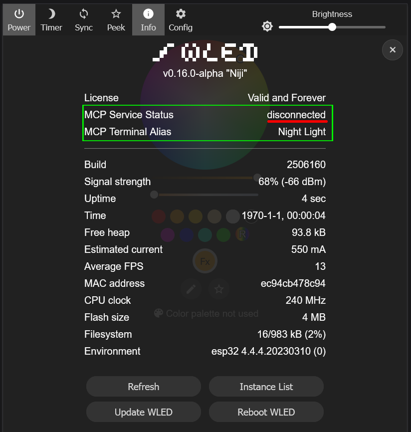
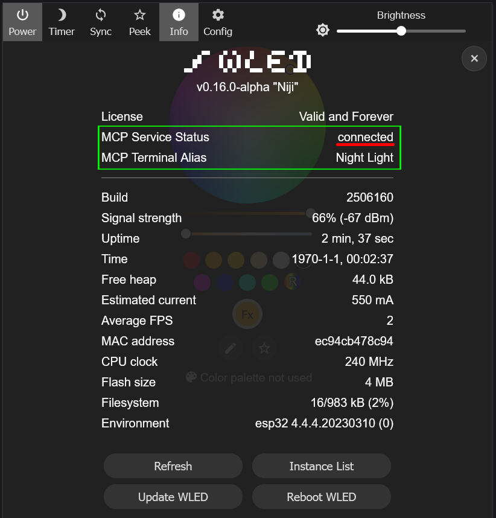
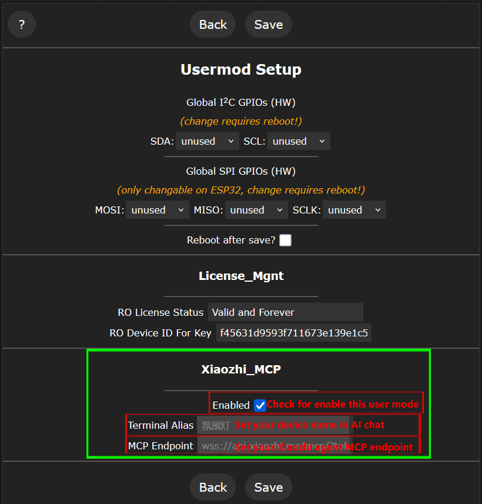
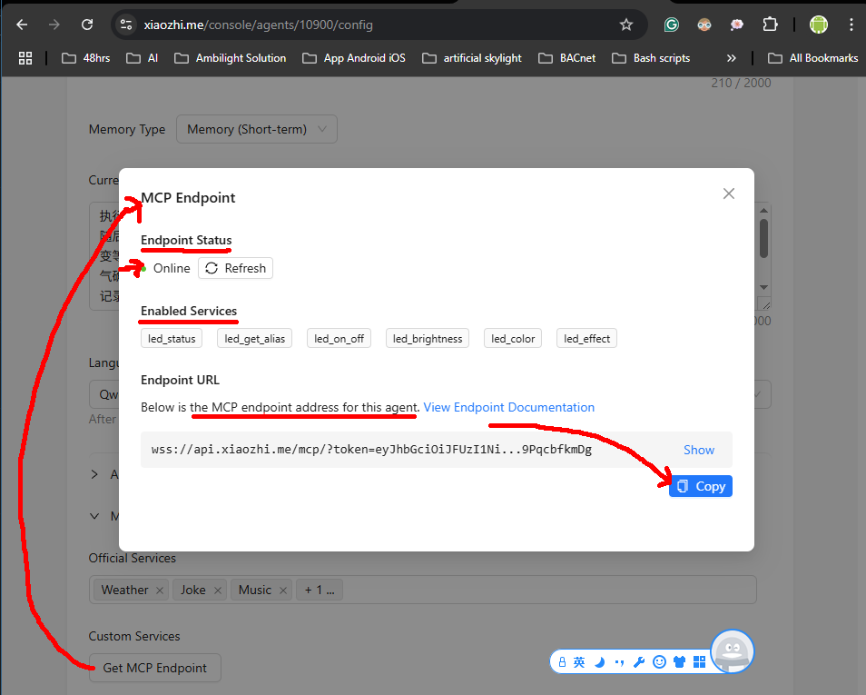
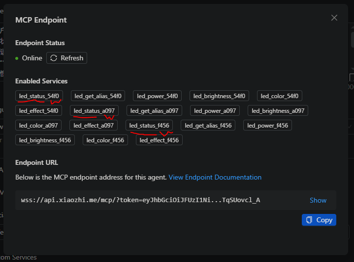

# Xiaozhi_MCP Usermod

# Note

This user mode leverages the xiaozhi-esp32-mcp as backend service to establish the connection/bidirectional communication to xiaozhi.me with the following adjustments:

* Use the xiaozhi_mcp-1.0.0.zip fetched from the https://www.arduinolibraries.info/libraries/xiaozhi-mcp and only keep the WebSocketMCP.h and WebSocketMCP.cpp files at minimal for Xiaozhi_MCP user mode.
* Use the wled.h header instead of the ones in the original header list (the wled project has built-in ArduinoJson.h).
* Translate the Chinese into English in the Serial.println function in this WebSocketMCP.cpp file and removed the blank line.

Copy all the content in the section `RO Device ID For Key` in License_Mgnt and send it to the vendor for key generation and service authorization. Without the device key, it will have a 60-minute FREE trial. 

Go to your device host ip + `/edit` (e.g. http://192.168.71.24/edit) in browser and import the key file naming `DEVICE_KEY`.

## Features
 - ✨ Adds the Xiaozhi AI platform connection status and MCP alias to the `Info` tab
 - ✨ Allows end user to enable/disable the Xiaozhi_MCP user mode (disabled as default), set MCP alias and endpoint in `settings`->`usermode` tab
 - ✨ Supports Xiaozhi AI agent to control multiple WLED instances built-in with Xiaozhi_MCP user mode via the customized MCP alias

## Use Examples
- Populate the Xiaozhi AI Agent MCP Endpoint (and alias) in usermod settings page
- This user mode will not run if MCP Endpoint (and alias) is not populated

## Compatibility
- ESP32 supports this user mode while ESP8266 does not support
- MCP tools (get the current status, power on/off, control brightness, set the color, set the effect and more - todo)

## Installation
- Add `Xiaozhi_MCP` to `custom_usermods` in your `platformio.ini` (or `platformio_override.ini`).

## 📝 Change Log

2026-01-18

- "Xiaozhi_MCP" usermod initial release with primary functions.

2025-12-31

- Documentation updated

2025-12-26

* "Xiaozhi_MCP" usermod created

## Authors
- M-Tech [@betamoojw](https://github.com/betamoojw)
